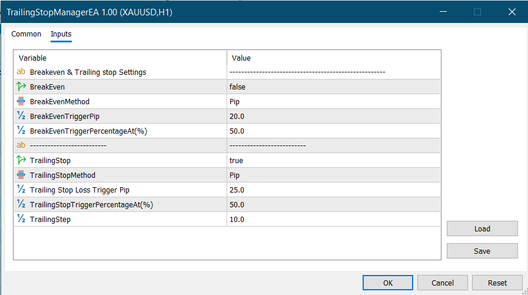

# MQL5 Trailing Stop Manager EA

A MetaTrader 5 Expert Advisor for managing stop-loss levels on existing positions using **breakeven** and **trailing stop** logic.

The EA can trigger breakeven and trailing stop adjustments using either fixed pip values or percentage-based levels relative to the trade's take-profit distance.

> ⚠️ This project is for educational and portfolio demonstration purposes only. Trading involves risk. It is not financial advice and does not guarantee profitable results.

---

## Overview

Trailing Stop Manager EA is designed to manage open positions on the current chart symbol.

It does not open new trades.
Instead, it monitors existing buy and sell positions and modifies their stop-loss levels based on the selected breakeven and trailing stop settings.

This type of tool can be useful for trade protection, risk management, and automated stop-loss adjustment.

---

## Main Features

* Manages existing MetaTrader 5 positions
* Supports buy and sell positions
* Breakeven feature
* Trailing stop feature
* Option to enable or disable breakeven
* Option to enable or disable trailing stop
* Pip-based trigger method
* Percentage-of-take-profit trigger method
* Adjustable trailing step
* Preserves existing take-profit levels
* Works on the current chart symbol
* Built with MQL5 and `CTrade`

---

## Breakeven Logic

The breakeven feature moves the stop loss to the position open price after price moves in favor of the trade by the required distance.

The trigger can be calculated using one of two methods:

### 1. Pip-Based Breakeven

The EA moves stop loss to breakeven after price moves a fixed number of pips in profit.

Example:

```text
BreakEvenTriggerPip = 20
```

This means the EA will move the stop loss to the entry price after the trade moves 20 pips in profit.

### 2. Percentage-Based Breakeven

The EA calculates the breakeven trigger as a percentage of the take-profit distance.

Example:

```text
BreakEvenTriggerPercentageAt = 50
```

If the take-profit distance is 100 pips, the breakeven trigger will be 50 pips.

---

## Trailing Stop Logic

The trailing stop feature moves the stop loss as price continues moving in favor of the trade.

The trigger can also be calculated using one of two methods:

### 1. Pip-Based Trailing Stop

The EA starts trailing after price moves a fixed number of pips in profit.

Example:

```text
TrailingStopTriggerPip = 25
```

### 2. Percentage-Based Trailing Stop

The EA starts trailing after price reaches a selected percentage of the take-profit distance.

Example:

```text
TrailingStopTriggerPercentageAt = 50
```

If the take-profit distance is 100 pips, trailing starts after 50 pips of profit.

---

## Input Parameters

| Input                             | Description                                                           |
| --------------------------------- | --------------------------------------------------------------------- |
| `BreakEven`                       | Enable or disable breakeven logic                                     |
| `BreakEvenMethod`                 | Select pip-based or percentage-based breakeven                        |
| `BreakEvenTriggerPip`             | Pip distance required to trigger breakeven                            |
| `BreakEvenTriggerPercentageAt`    | Percentage of take-profit distance required to trigger breakeven      |
| `TrailingStop`                    | Enable or disable trailing stop logic                                 |
| `TrailingStopMethod`              | Select pip-based or percentage-based trailing stop                    |
| `TrailingStopTriggerPip`          | Pip distance required to activate trailing stop                       |
| `TrailingStopTriggerPercentageAt` | Percentage of take-profit distance required to activate trailing stop |
| `TrailingStep`                    | Distance in pips between current price and new stop loss              |

---


---

## Screenshot

### Input Settings


## How It Works

For each open position on the current chart symbol, the EA checks:

1. Position type: buy or sell
2. Open price
3. Current stop-loss level
4. Current take-profit level
5. Current price movement in profit
6. Selected breakeven method
7. Selected trailing stop method

If the breakeven condition is met, the EA moves stop loss to the entry price.

If the trailing stop condition is met, the EA updates the stop loss behind the current market price using the selected trailing step.

---

## Installation

1. Download `TrailingStopManagerEA.mq5`.
2. Open MetaTrader 5.
3. Go to:

```text
File > Open Data Folder > MQL5 > Experts
```

4. Copy `TrailingStopManagerEA.mq5` into the `Experts` folder.
5. Restart MetaTrader 5 or refresh the Navigator panel.
6. Attach the EA to the chart.
7. Enable Algo Trading.
8. Configure the breakeven and trailing stop inputs.

---

## Important Notes

* This EA does not open trades.
* It only manages existing positions.
* It works only on positions matching the current chart symbol.
* Percentage-based mode depends on the position having a valid take-profit level.
* Always test on a demo account first.

---

## Risk Warning

Trailing stop and breakeven tools can help manage risk, but they cannot remove trading risk.

Market gaps, spread changes, slippage, broker execution rules, and fast market conditions may affect stop-loss modification.

The developer is not responsible for any trading losses.

---

## Project Structure

```text
mql5-trailing-stop-manager/
│
├── TrailingStopManagerEA.mq5
├── README.md
└── screenshots/
    └── input-settings.png
```

---

## Developer

**MubinCodes**
Software Developer specializing in MQL4/MQL5 trading bots, custom indicators, Python automation, and financial software.

GitHub: https://github.com/MubinCodes
Fiverr: https://www.fiverr.com/mubinbhaiya?public_mode=true
